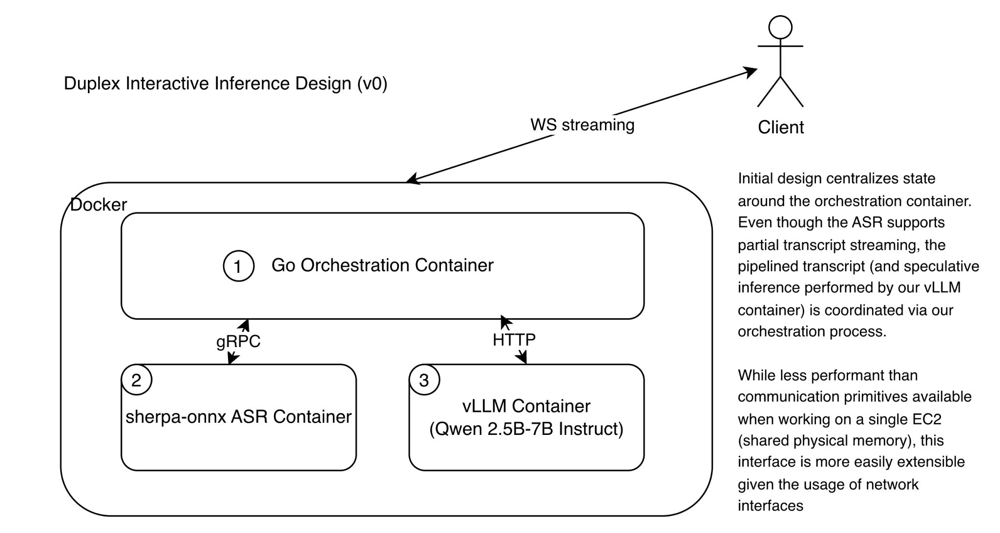
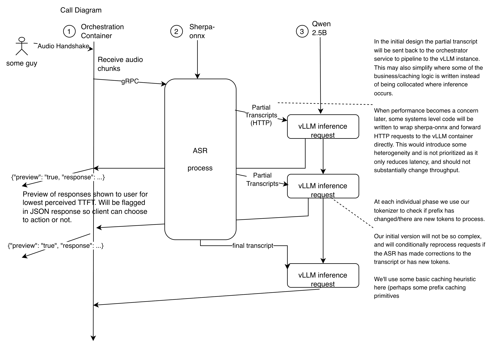

## Problem Statement

Working with audio helps speed up one component of agentic workflows - the unfortunate limitation of human appendages (our fingers! and our brain...) - for translating thought into useful input. Exposing that as an interface takes some careful thought and consideration but the goal of this project is to set up the baseline platform that enables this multi-modal inference.

## Goals

#### Latency
The guiding principle of this project is latency. Even the higher level goal of an integrated coding workflow for agents in some IDE (maybe neovim) is all with the end goal of cutting (questionably) precious seconds in converting thought into implementation. This can happen two ways: 
- reducing the friction of using a product
- reducing the actual performance "latency" of the underlying "engine"

Speaking with regards to inference, using voice itself already reduces a lot of friction as a medium where humans already speak around ~3x faster than they can type (* see footnote 1.). Making that useful also means that there needs to be some transformation of that input into some feedback the user sees in a reasonable amount of delay - giving us a ballparked latency budget of around 2 seconds. There are UX improvements to make higher latencies less painful but that's not the goal of this project

#### Adoptability
Adoptability is a really important personal goal as for the ambitious wants of a "personally" optimized IDE, it probably matters that the interfaces/primitives we're able to expose for this inference platform are easy to build with. There's also other things which are important for adopting a project like this - namely that it should be deployable to some popular cloud platform - which is also important if you lack an on-prem set up. It's also nice that these providers already will have well thought out interfaces for the compute, storage, and scalability we'll need to a good degree.

#### Performance...
Performance means many things. Reading the reading list will probably help, but we care about both throughput (tok/s) and also TTFT (s). Using duplex interaction is only useful if the outputted text also is used in a similar manner so this may mean pipelining, or some sort of speculative inference on the partial ASR output to reduce latency. These metrics are already touched upon in latency, but we also care about actual scalability when talking in terms of performance.

I don't have a huge personal wallet, and its important that we're able to scale this architecture to work for multiple users. Batch requests, HPA scaling etc. are probably considerations here. This is not the primary goal but is still important, so you might notice less emphasis on this in this (initial) design.

## Tradeoffs

#### Latency vs "Correctness"
 Partial ASR and early actual LLM inference can reduce perceived latency but comes with the cost of correctness as these partial ASR's may be corrected which may waste work (while not entirely if KV caching uses a prefix cache, it's still something to consider). The actual model tools/prompt could restrict that actions which mutate state or are destructive should happen after the full ASR is completed but thought text could be included.   

 #### Modularity and Performance
Having ASR and LLM servers does increase latency even if pipelining subsidizes some of that TTFT and makes throughput the main bottleneck. This is mainly for ease of observability and composability. Performance may become a bigger concern in the future. We're already prioritizing latency so partially wasted work or (certainly) costlier scalability is not going to impact the design substantially unless it makes other goals infeasible.

## Design

### Layers

#### API 
This interface will be served using a Go server probably using gorilla websockets for streaming and for basic routing/service layer components. The API will be compliant with OpenAI's websocket mode API (* see footnote 2). The client will otherwise receive actions or text via JSON encoded messages and use binary audio frames.

Authorization will use some simple bearer token, which will eventually be conducted through some general auth service, but for now will use a API key (perhaps rotating). 

#### Orchestration
The Go server will also be responsible for session state management and orchestration. This will mostly be handled in memory (for any hot operations e.g. active session maps and transcripts updates/append operations from inference ASR).

Orchestration also means that go will encapsulate the required pipelining of inference from ASR to LLM, taking client PCM/ogg (whatever audio encoding we go with) -> ASR -> Go orchestration server -> LLM -> G orchestration server -> back to client as structured transcript/tool response.

#### Inference Engine
ASR will be served using sherpa-onnx's Go API and we'll serve some small non-reasoning model (see below) using vLLM because of its built in prefix caching, which will be desirable given the shared prefixes that these transcripts have. We'll likely serve vLLM via its Python API. In the long run we may eventually move to TensorRT-LLM but at the moment it's not a priority 

#### Model Selection
After (very) briefly reading some evals and looking at the parameters we care about, Qwen 2.5-7b-Instruct is probably what we want. It's a dense model but with only 7B parameters it will be able to fit on a cheaper GPU. After some validation we may deploy a MoE model like the Qwen 3-30B-A3B, but it will require substantially more memory, or perhaps quantization (which may be interesting to look into after this is initially built out).

#### Deployment
Because we're targetting AWS as our deployment platform - we'll use docker, and specifically use docker-compose to set up our containers and also orchestrate them. From our current design we have three containers: 

1. Go Serving/Orchestration container
2. sherpa-onnx ASR container
3. Qwen 2.5b-7b vLLM container

## Artifacts (TODO)
(Link to github eventually)

## References/Footnotes
Not APA, but I'm lazy ;D

*1. See this article for details about how voice is faster than typing.

https://hci.stanford.edu/research/speech/. It is a bit of an exaggeration that it's as dramatic as a 3x speedup as anecdotally I type around 150 wpm which is equivalent to the average speech input speed. That's not to say there is inherently less friction with this modality and conveying ideas. Writing and speech are different and serve different purposes. Personally I find writing useful for reflection (at which point I probably care less about speed in the first place), but dictation is probably more in line with how I think using an internal monologue and it's just less friction to speak out a command than type it.

*2. I think this is the specification...

https://developers.openai.com/api/docs/guides/websocket-mode
https://developers.openai.com/api/docs/guides/realtime
