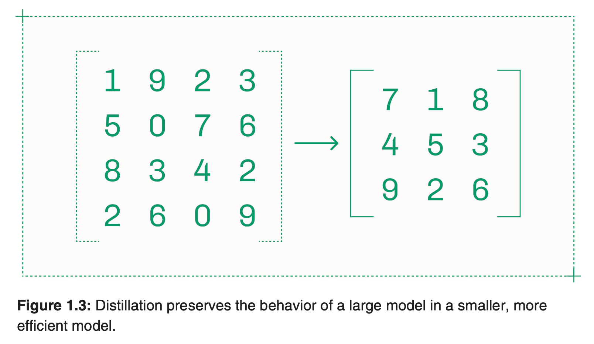
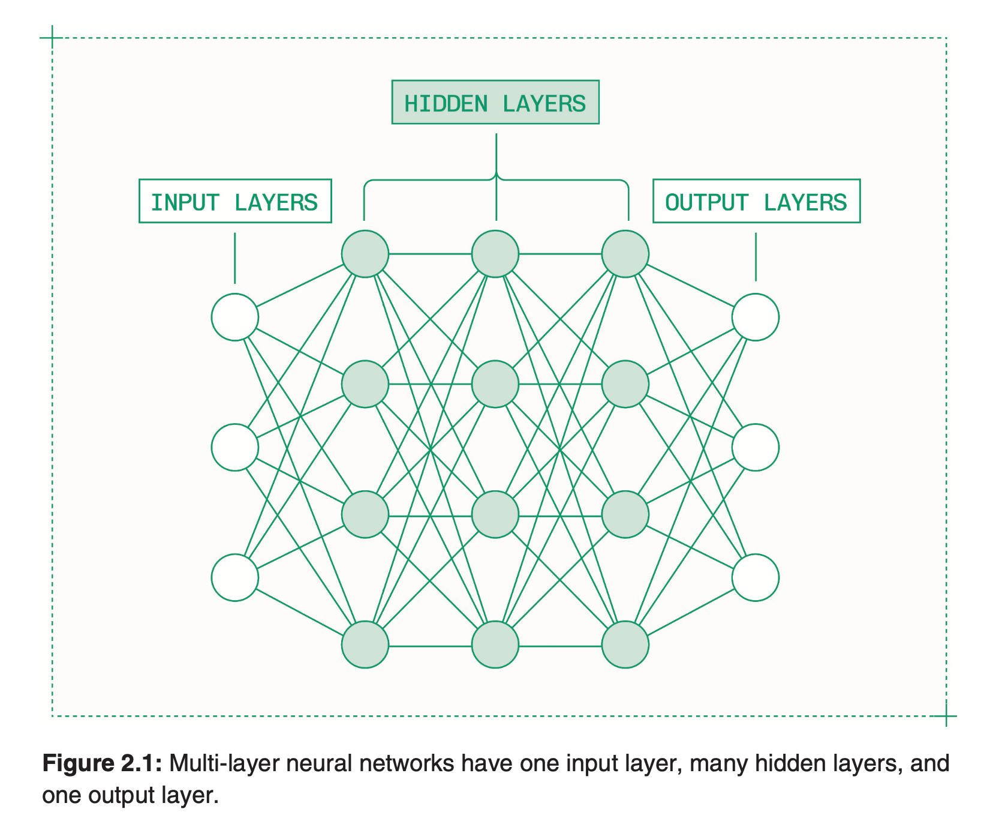
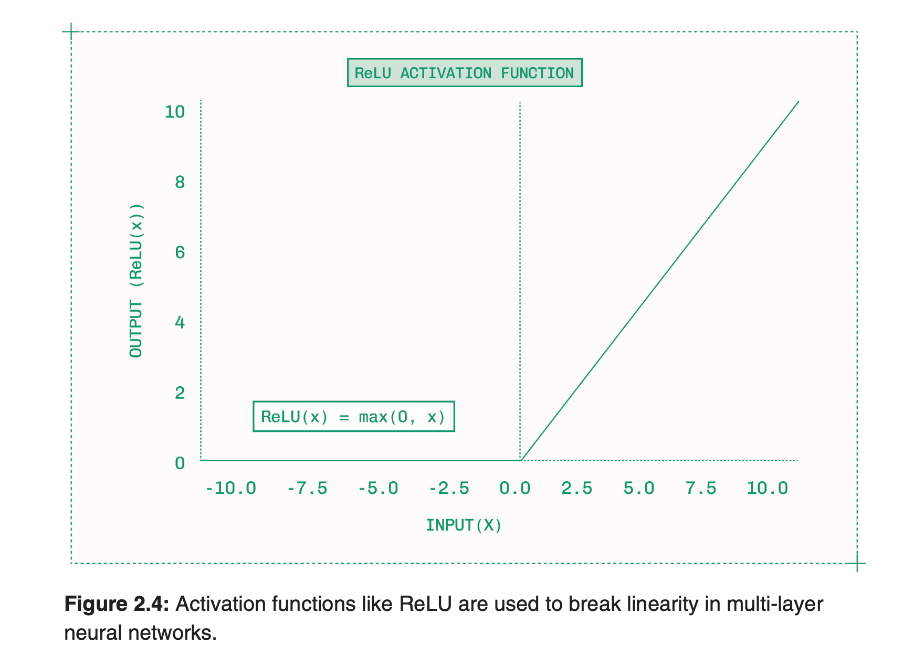
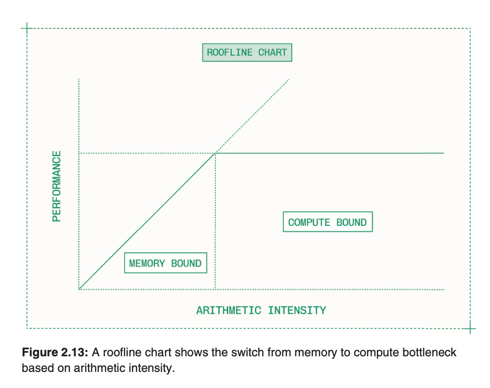
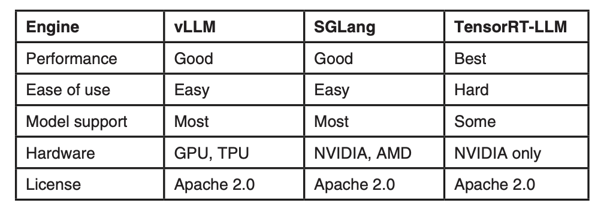
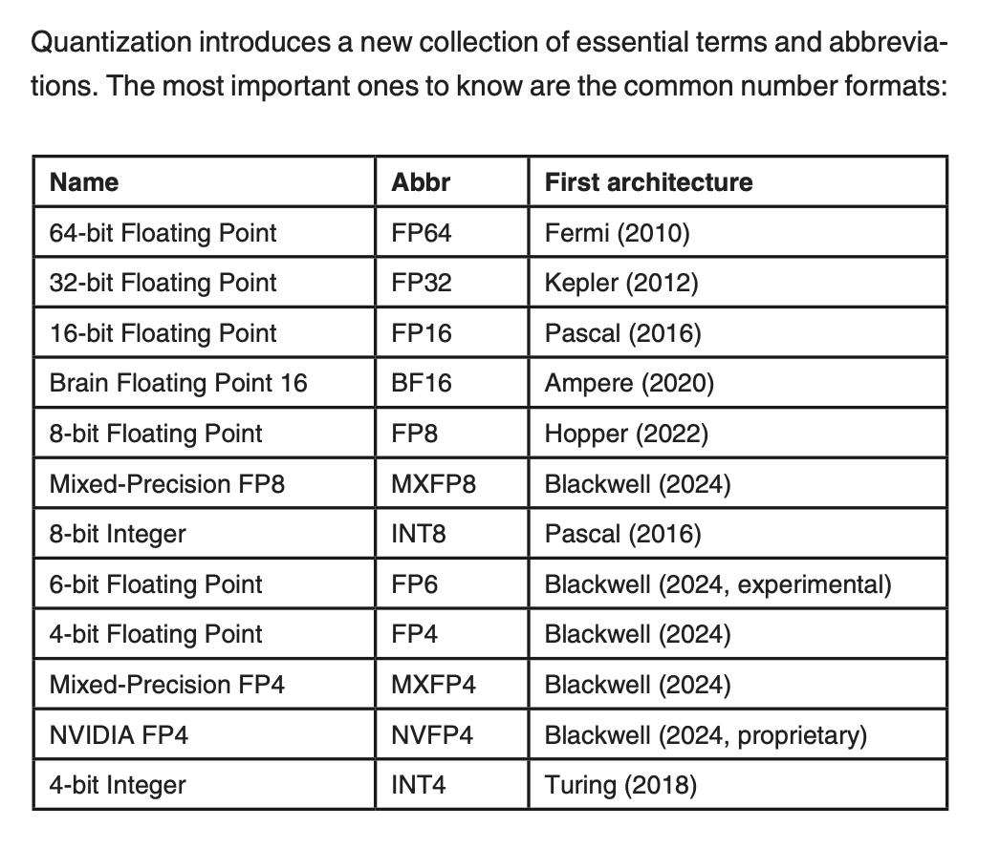
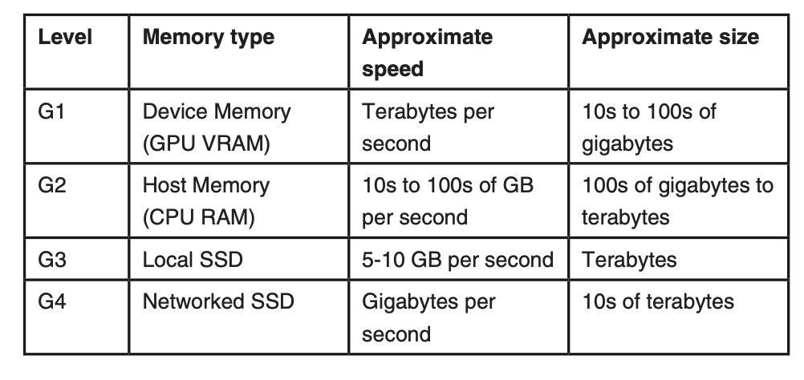

## Overview

This is heavily inspired by Baseten's inference book (which is frankly is also a brief introduction to inference). If you need more detail go read that or go through the linked [Reading List](#/inference-reading-list).

Inference is the second phase of a model's life cycle, where the models are served or used in production. The main layers involved in inference are the runtime (which optimizes the single model on a GPU-backed instance), infrastructure (the ability to scale across cloud, hardware, and regions without creating silos), and tooling (which is used to build software that scales, hopefully in an ergonomic manner).

This organization intends to begin mainly building around infrastructure and tooling, although with more experience (and time) perhaps certain projects will branch into other layers. Let's first discuss some metrics that we care about when it comes to inference.

**What are TTFT and tok/s?**
TTFT is time to first token, and it means that with a streaming output, how long does it take for a user to see the first output. Its bounded by compute-bounded prefill (kv cache). The metric means better latency
Tok/s is the tokens per second, and it refers to the throughput, which is bounded by bandwidth bound decode.

Prefill is computation heavy because it takes the input in parallel and must generate the key/value pair for each token at each layer, requiring massive parallelization (due to the matmul that is involved on the GPU). The model's weights are only loaded a single time, and then a large matmul between inputs and attention occurs, which only needs one read from memory

Decode is bandwidth heavy as it is autoregressive, which means referring back to every single decoded token as a dependency for the next token. Each requires all model weights from HBM (high bandwidth memory) to go to the processing cores. Small batch sizes also means that the GPU cannot amortize the cost of moving weights across multiple tokens. There's some additional terms here like perceived TPS (which discounts the TTFT) and total TPS which is the total number of tokens generated. ITL is also the inverse measuring frequency instead of rate. Model weights need to be loaded for every token to do so.

**Benchmarking** is also important, and similarly to other parts of engineering, values lke median and mean are typically used. Right-skewed distribution is common for inference because of outliers.

| Percentile | definition      | impact                   |
| ---------- | --------------- | ------------------------ |
| P50        | Median          | 1 in 2 is slower         |
| p90        | 90th percentile | 1 in every 10 is slower  |
| p95        | 95th percentile | 1 in every 20 is slower  |
| p99        | 99th percentile | 1 in every 100 is slower |

## Models

Before going into building out an inference system, one must decide what model to run! While there isn't a requirement to deeply understand model architecture. Most of the time evals are used to decide what is worthwhile and what is not.

Intelligence benchmarks are useful for shortlisting models.
- ensure that you check the data and the eval results for a specific problem space
- be precise about the hardest problem that the model will need to solve
- tools lol.

We'll also briefly cover some useful concepts when it comes to models:

**Distillation** is the process of using a large teacher model to train a smaller student model to emulate the larger model's behaviour. Unlike fine tuning, the distillation just shows the student model the teacher model's actual distributions (rather than the answers, all credit to Phillip Kiely for the following figure from Baseten's textbook)

DeepSeek R1 is a reasoning model with 671 B parameters, but the distilled models are the most popular on hugging face because they yield far more reasonable metrics (ttft, tok/s) with reasonably close performance to the original baseline. 

This section heavily cuts on details on transformer architecture and different models, so if you care, please go through the reading list. We'll focus on autoregressive token generation (because this is usually more useful for codegen because we're focusing on LLMs!)

### Neural Networks

Neural networks are our foundation for models, so this section goes over them at a very high level. Checkout the reading list - which also doubles as my reading list.

The fundamental unit of a neural network is a node. Where it is a hsort program taking an input, multiplying it by weights, adding some bias, and returning the results
- groups of nodes form layers
- nodes within layers are independent
- connections are the network - where nodes receive the output of the previous layer

There are also three fundamental layers!
- input layer: where we accept and process the input
- hidden layers: every layer that is within the first and the last, which iteratively transforms input to arrive at an output (aka the blackbox)
- output layer: the final layer, which returns the prediction from the network

each layer produces an output for the next to read, and these outputs are hidden states

These are for creating internal representations, and there are also neural nets for using them:
- encoders take inputs like text to create these internal representations (and additional semantic meanings)
- decoders use the internal representation to generate our useful output

They are composable! Modern LLMs are decoder only, and encoder models are somewhat rare

every matmul is sorta just y = mx + b (not really) - but this is a linear layer which is its simplest form.

**Activation functions** are used because matmul is composable, and so mul tiplying vectors by two matrices is the equivalent to the product of those matrices. In multi-layer networks, each would collapse, so deep layer networks are more useful for having more parameters and encoding more meaning in hidden states. Neural nets break linearity by having activation functions that are non-linear to prevent composability (and are differentiable to support back propagation usually... - IDK backprop or the math involved but sure)

### LLM Inference
- LLms are autorgressive which means each token is based on the previous one. Texts and tokens are just a mapping, and dont require nets. Language model vocab is the complete mapping of tokens and strings
- most have over 100k tokens in vocabulary, and as such our sequences are as follows

- input sequence: prompt, chat, context, functions and inputs passed into the llm
- reasoning sequence: optional, to have an intermediate output
- output sequence: response generated

the mechanics here have sort of been hinted at, but are essentially prefill and decode.

**Prefill** - processing the input sequence to calculate attention, i.e. a weight/score, for each input token (storing each value in the KV)
**Decode** - perform forward passes through the model to generate tokens autoregressively. 

Decoding takes a few extra steps since outputs are not tokens, and so the layer will generate a vector of logics, and the length is the same as our original vocabulary. With normalization, these logics represent probability of each potential token, and with a weighted random number generator they are selected. We see some familiar terms appear here again

Temperature: randomness (adjust before normalization)
Top-k: select top-k most likely after normalization (then re-normalize among them, i.e. reducing output probabilities)
Top-p: greedily choose the smallest set of tokens after normalization that have probabilities that add up to p (lower is more deterministic)

### Nomenclature

Very quickly model nomenclature typically consists of

Family-Version-\[MoE\]-\[Other specifics\]-(parameter size)b-a(active parameters)b.

### Transformers
Transformers are the main blocks that compose LLMs, but this section will be completed at a later date after some additional reading.

### Inference Bottlenecks

As mentioned previously, we are typically either memory or bandwidth bound, but ideally we are balancing our work s.t. both are fully utilized at all times.

We can model this with our Ops:Byte ratio and arithmetic intensity. Each GPU has a specific compute speed (measured in operations per second) and memory bandwidth (measured as GiB or TiB per seconds). We can compare these to determine an ops:byte ratio of a given gpu.

Because the ratio is measured on a per-second scale, this can be measured against the bandwidth ceiling.

If under the ceiling of bandwidth, we are memory bound, and if above we are compute bound.

## Hardware

There are three types of GPUs on the market. 
- Datacenter GPUs, which are racked
- workstation GPUs, which are for professional workflows (RTX Pro 6000)
- personal computing gpus, which are used for everyday use

for most intents and purposes, if you need inference to scale, you have to have access to datacenter gpus. This means doing one of three things
- Cloud: renting someone elses datacenter
- On-prem: having your GPUs installed in a datacenter that you control
- Air-gapped: having your own on-prem gpus that must be physically accessed 

What metrics do we care about?
- CUDA Cores - which operates on individual numbres (or scalars)
- tensor cores - which operate on vectors and matrices

Gpus are also interconnected to communicate using either
**NVLink** a one to one communication layer between gpus
**NVSwitch** an all-to-all communication layer

Each hardware company is competing to win on these workloads, so memory bandwidth, power efficiency and platform integration is what differentiates them.

## Software

[TODO] Some things to write about SGLang, TensorRT and vLLM... will be filled out upon more research.

CUDA is how code is run on NVIDIA GPUs, although CUDA is actually several components
- kernels: user defined function that executes parallelized code on the GPU (not much unlike the OS kernel)
- CUDA graph: a dag or kernels and other gpu operations for optimizing repeated workflows
- CUDA drivers: an low level interface between the application and the GPU hardware to manage memory and execution
- CUDA runtime: dev facing api for launching kernels and managing memory

> [!NOTE] Kernels - at a very high level
> At least as this project currently stands, we won't be writing our own kernels, but it is helpful to know kernels are specific to the hardware topology. Most of the time selection is automatic, but a few kernels may be selected to speed up inference.
>
> Kernel fusion can help reduce memory accesses (but as we said previously, not all kernels are composable if they are non-linearizable)

### Frameworks and libraries
TensorFlow is an e2e ML platform
JAX is a research project with a simpler interface
PyTorch is a python package for describing tensor operations, which is currently the standard for training and inference.

### Model File formats
- safetensors is the standard, set by hugging face, where safetensors only hold tensor data and not executable code. 
- some additional features include that they format memory using a mapping to ensure that the files are loadable without allocating full memory

ONNX (open neural network exchange) stores the weights along with an execution graph, and as such ONNX bundles things together.

### Inference engines

vLLM has broad support for hardware and different architectures. However, because it is so broadly constrained, there are performance gains to be wanted. Generally the performance losses don't matter when using a smaller GPU or older architectures where TensorRT-LLM does not offer benefits

SGLang is quite dominant because of chinese open models and also because its xAI's engine of choice. SGLang is great for large MoE models, and if you want to contribute back (not quite ready for that yet!)

TensorRT-LLM is NVIDIA's open source inference engine, and offers the highest performance because its abstractions can be used at the lowest level.

### NVIDIA Dynamo
is a distributed system fro model serving, which works with every engine. Dynamo is the orchestration layer which enables KV cache re-use (based on prefix match), disaggregation, and multi-node parallelism.

## Techniques

### Quantization
Quantization improves latency (in TTFT and TPS), throughput, and headroom for other optimizations. Since models are trained with weights this is usually represented in a certian native number format. (BF16 or FP16).

Post training, this works to change model weights by moving to a lower-precision format. Prefill will run on lower-precision tensor cores (inversely correlating with number of FLOPS). Decode now loads a factor less data per value, which inversely affects the bandwidth.

some more nomenclature surrounding number formats as well is helpful to note!

FP32 is almost never used for inference but used for training. FP6 is a bit more experimental, but that means 16, 8, and 4 are the main formats.

The formats have:
- precision: the number of bits used to express a single value
- type: are we representing an integer or floating point
- scale factor: a multiplier used to map values from low-precision back to higher-precision

These attributes determine two factors behind how well a number format represents values in inference
- dynamic range: the difference between lowest and highest value that can be represented
- granularity: the number of parameters or other values that can be quantized with the single scale

Intuitively, floating point helps with dynamic range compared to integer formats, because of the sign, exponent factor, and the mantissa (summation of fractions multiplied by two to the exponent). The exponent gives a higher dynamic range

quantization can be applied at the tensor level (the scale factor for QKV), channel level (where we calculate a different scale factor for each feature), and the block level, where the vector is divded into blocks of n values and having a scale factor

granularity has a lower chance of smoothing outliers and thus preserve quality, but alos results in more overhead.

Generally quantization can happen during or after training, but since we're not training the models... we'll discuss post-training.

1. what parts of the model should we quantize 
2. what number format offers the appropriate dynamic range and granularity?

Typically the hierarchy of risk of model degradation after quantization is as follows (from least to most risky)
1. weights (especially linear layers)
2. activations (intermediate outputs are only somewhat sensitive, but they're also only a fraction of the weight)
3. KV cache - quite sensitive
4. attention - very sensitive!

#### TurboQuant
- .... will finish this section at some point after some more reading

#### Speculative decoding
Since decode is autoregressive, the bottleneck is memory bandwidth, with compute barely doing anything with low to moderate batch sizes. Speculative decoding attempts to use the spare compute to generate multipile tokens per forward pass through the target model, and may improve TPS/ITL

in general the mechanism used is as follows:
1. the speculator generartes one or more draft tokens
2. the target model (which we are accelerating) validates these tokens to see if they match what the model would've generated
3. the model accepts valid draft tokens and generates one token itself, completing the forward pass

this is not free, but validation is a lot quicker than generation! (just like NP hahaha.. anyone?)

the performance depends on a couple factors:
1. draft token cost: the time for the draft token to be generated
2. draft sequence length (# of toks per forward pass)
3. tokekn acceptance rate (how accurate the draft tokens are to the target model)

**Draft Target Speculative Decoding** Was the original method to do this, with the draft and target model. The draft models are usually just smaller members, with about a factor of 10 smaller than the parent.

**Eagle** - will write after reading the paper... but in short
Draft models like Qwen 0.5B are not good standalone LLMs on the hardware used by larger models (as they are designed to take advantage of cheap hardware! not data center GPUs)

EAGLE is a purpose-built draft model trained from scratch to generate sequences of up to eight draft tokens, with a high acceptance rate. Because LLMs accumulate context during inference about predicted tokens in hidden layers, EAGLE can be trained to accept these hidden states and generate speculative tokens as output. It takes an early, middle, and late layer typically. 

Additionally this implementation lends itself to being part of the pipeline, which reduces round trips to CPU to orchestrate the draft model

#### N-gram Speculation and lookahead decoding
N-gram speculation uses different mechanisms other than speculation, with no draft model. While generating the KV cache, the inference engine constrcuts an n-gram dictionary. N-gram dictionaries map the single starting token to an observed sequence of N tokens (i.e. the n-gram), which matches prefixes to likely suffixes. During decode, generated tokens are fed in, and any available suffix are used as draft tokens.

N-gram can generate far longer sequences, but unfortunately it is only accepted at a high rate if the output and input content are similar. It is mainly used for code completion and revision, in domains with predictable results and inputs - helping it out perform EAGLE.

### Caching
Let's see if caching continues to be my favourite topic!
- in prefill our inference engine builds a KV cache on an input sequence and updates the cache for each token during a decode.
- the additional utility on top of improved autoregression is re-using it between requests

When two sequences share a prefix, the KV cache can be reused from the first request to improve TTFT by skipping the prefill stage. Prefix caching can skip prefill on a great deal of tokens in specific use cases
- complex system prompts: agents, tool calls often feature long prompts (which are the same for every call)
- code completion: repetitive/constrained tasks that require the same lines of code shared as context
- documents and retrieval: summarization, Q/A on the same document
- multi-turn conversations: conversations are repetivive, so serving a language model at large scale benefits from prefix caching

In actual prompting, it is desirable to have novel tokens as late in context as possible, but there is research that is in this domain which is attempting to support non-prefix sequences

#### Storing the KV 
KV caches take up a lot of memory, and oen could configure how much memory is allocated to the cache, but this means you'll need some eviction strategy which means you are no longer consistently increasing your cache hit chance. Therefore we have 4 typical places to store these caches close to an accelerator.

#### Cache-Aware Routing
At scale we also know that since there are multiple replicas, incoming traffic is split. In traditional software engineering we do it based on load, but we may instead choose to have requests from the same user routed to the same replica as often as possible - especially for codegen, agents, or complex repetitive tasks.

Global caches are also possible, but introduce other tradeoffs \<insert more notes here...>

#### Long Context Handling
Sequences are "long context" when they become long enough to cause problems with the KV cache during inference - and typically emerge past common cutoffs like 32k, 64k etc tokens (if our kv cache needs to evict, our inference more closely resembles something parabolic - regardless of eviction strategy)

Methods like flash attention, paged attention, and chunked prefill help with this. Read more about this on your own if you're interested!

## Model Parallelism

There are three forms of model parallelism:

**Pipeline Parallelism**
- splitting the layers of the model across the gpus

**Tensor Parallelism**
- splitting the tensors within each layer across gpus

**Expert Parallelism**
- shards entire experts (in MoE models) acros smultiple gpus

| type | mechanism | drawback |
| -- | --| --|
| PP| each gpu handles a stage of the forward and backward pass | not recommended because of poor latency and utilization from the step-by-step pipeline |
| TP | Compute heavy operations like matmuls are split across GPUS | requires finegrained synchronization, and is not suitable for multi-node |
| EP | Each expert lives in one GPU, making in expert inference fast | Requires complicated routing to reach multiple experts to achieve improved throughput |

Tensor Parallelism is the best for low latency model inference within a single node, and expert improves throughput for MoE LLMs. Pipeline is only used for multinode inference.

### Tensor Parallelism for Lower Latency
- this is the default strategy for multi-GPU infernce. Each layer of the model is splitand is distributed across allocated GPUs. The expense of reading weights and executing matmul is shared. These layers need communication in reducing fashion to a single output, so high-bandwidth intra-node links are necessary to reduce overhead.
- typically this is better for TPS on a per user basis, and with large enough models

### Expert Parallelism
experts in a model are split up across gpus. It improves total system throughput and makes inference more scalable (since individual experts process tokens separately)
- there's less inter GPU communication than in TP, and the router is replicated onto each gpu.

### Multi-node inference
- huge models with high precision, or million token input sequences might need a lot more gpus. 
- this introduces new challenges:

    - Infrastructure: how do you provision two ore more interconnected gpu nodes and build across cloud providers
    - parallelism: how do you communicate over infiniband (which is magnitudes slower than NVLink?)

## Disaggregation

Disaggregation combines three ideas!

1. prefill is compute-bound and the determines TTFT, while decode is a memory bound process that determines your TPS.
2. specialization improves performance in everything from selection to parameter tuning
3. Models can be parallelized via multiple gpus or even nodes (if bottlenecks from low-bandwidth interconnects can be avoided)

It works by having the prefill engine take the input sequence and generate a KV cache while computing the first token.

Then the prefill engine moves the KV cache over the interconnect to the decode engine

The decode engine computes all subsequent requests. Conditional disaggregation usually checks whether the inpnut sequence is already cached or if it needs to be routed to a prefill engine. This approach is better for real world traffic. It requires lower TP than memory-bound decode.

#### Use cases
1. huge traffic - so not really us.
2. serving a large model - usually > 100b
3. traffic is prefill heavy

if one or two are not true, the performance gains are not really worth it. (hence why our original idea of a disaggregated engine over edge networks is not worth it as the largest feasible model would've been 35b)
